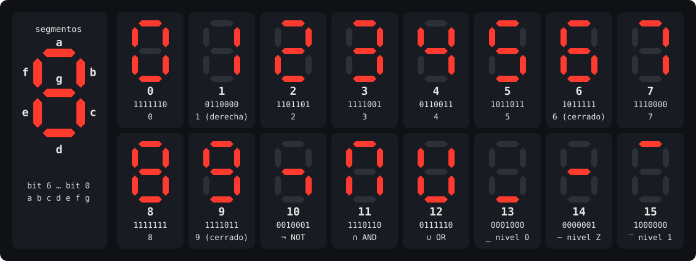
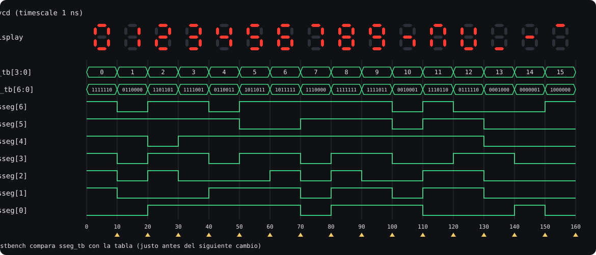

# Taller de segundo corte: decodificador de 7 segmentos

**Sistemas Digitales · 2026-2** · Estudiante: Diego Florez y Camilo Moreno

Tabla de decodificación, simulación y generación de HDL con el script del curso
[`sevensegdec.py`](https://github.com/dargor0/usbbog/blob/main/digitales_2026_2/sevensegdec.py),
y migración de las pruebas a **pytest**.

## Contenido del repositorio

```
decodificador-7seg/
├── README.md                    ← este informe
├── tabla.txt                    ← tabla de decodificación (16 líneas × 7 bits, orden abcdefg)
├── sevensegdec.py               ← script base del curso (sin modificar)
├── requirements.txt
├── hdl/
│   ├── vhdl/sevensegdec_nexys.vhd      ← HDL generado (VHDL)
│   ├── vhdl/pck_myhdl_011.vhd          ← paquete de soporte que genera MyHDL
│   ├── verilog/sevensegdec_nexys.v     ← HDL generado (Verilog)
│   └── verilog/tb_sevensegdec_nexys.v  ← envoltura de co-simulación que genera MyHDL
├── simulacion/
│   ├── sevensegdec_tb.vcd       ← Value Change Dump de la simulación
│   └── salida_consola.txt       ← salida de todos los comandos
├── pruebas_unitarias/
│   ├── sevensegdec_mod.py       ← script modificado: solo la lógica del decodificador
│   └── test_sevensegdec.py      ← pruebas pytest (16 casos parametrizados)
├── herramientas/
│   ├── generar_figuras.py       ← dibuja img/*.svg a partir de tabla.txt y del VCD
│   └── ecuaciones_sop.py        ← ecuaciones booleanas mínimas de cada segmento
└── img/
    ├── patrones.svg
    └── ondas_vcd.svg
```

---

## 1. Tabla de decodificación

### Convención

Cada línea de [`tabla.txt`](tabla.txt) tiene 7 caracteres en el orden **`abcdefg`**. La función
`read_table` del script convierte cada línea con `int(linea, 2)`, así que el **primer carácter
(`a`) queda en el bit más significativo**: `a = sseg[6]`, `b = sseg[5]`, …, `g = sseg[0]`.
Un `1` significa **segmento encendido** (lógica activa en alto).

```
     aaaa
    f    b
    f    b
     gggg
    e    c
    e    c
     dddd
```

### Patrones



| Valor | Entrada `bcd` | `abcdefg` | Segmentos encendidos | Símbolo |
|:-----:|:-------------:|:---------:|:---------------------|:--------|
| 0  | 0000 | `1111110` | a b c d e f   | 0 |
| 1  | 0001 | `0110000` | b c           | 1 (a la derecha) |
| 2  | 0010 | `1101101` | a b d e g     | 2 |
| 3  | 0011 | `1111001` | a b c d g     | 3 |
| 4  | 0100 | `0110011` | b c f g       | 4 |
| 5  | 0101 | `1011011` | a c d f g     | 5 |
| 6  | 0110 | `1011111` | a c d e f g   | 6 (cerrado) |
| 7  | 0111 | `1110000` | a b c         | 7 |
| 8  | 1000 | `1111111` | a b c d e f g | 8 |
| 9  | 1001 | `1111011` | a b c d f g   | 9 (cerrado) |
| 10 | 1010 | `0010001` | c g           | ¬ (NOT) |
| 11 | 1011 | `1110110` | a b c e f     | ∩ (AND) |
| 12 | 1100 | `0111110` | b c d e f     | ∪ (OR) |
| 13 | 1101 | `0001000` | d             | _ (nivel lógico 0) |
| 14 | 1110 | `0000001` | g             | − (alta impedancia Z) |
| 15 | 1111 | `1000000` | a             | ‾ (nivel lógico 1) |

### Decisiones sobre los dígitos 0–9

- **El 1 se dibuja a la derecha** (segmentos `b` y `c`, `0110000`). Es la forma estándar, la
  misma que usan decodificadores comerciales como el 7447/7448. A la izquierda sería `e f`
  (`0000110`).
- **El 6 se dibuja cerrado**: enciende el segmento superior `a` (`1011111`). El 6 abierto
  (`0011111`) es idéntico a la letra **b** minúscula de la notación hexadecimal, y se
  confundiría con ella.
- **El 9 se dibuja cerrado**: enciende el segmento inferior `d` (`1111011`). El 9 abierto
  (`1110011`) parece una **q**. Además, con las dos formas cerradas el 6 y el 9 quedan
  simétricos: el 6 rotado 180° (a↔d, b↔e, c↔f) da exactamente el 9.
- El 7 se dibuja con tres segmentos (`a b c`), sin el segmento `f`.

### Símbolos propios para 10–15

Tema escogido: **símbolos de Sistemas Digitales**. De 10 a 12 son operadores booleanos y de 13
a 15 son los niveles lógicos tal como aparecen en un visor de ondas. Ninguno es una letra A–F y
ninguno repite un patrón de 0–9 (esto lo verifican las pruebas unitarias, sección 5).

| Valor | Símbolo | Justificación |
|:-----:|:-------:|:--------------|
| 10 | **¬** | La barra media (`g`) con el trazo que baja por la derecha (`c`) forma exactamente el signo de negación lógica **NOT**. |
| 11 | **∩** | El arco cerrado por arriba es la intersección de conjuntos, que en álgebra booleana corresponde a la operación **AND**. |
| 12 | **∪** | El arco abierto por arriba es la unión de conjuntos, el equivalente de la operación **OR**. |
| 13 | **_** | Una sola línea abajo representa el **nivel lógico bajo (0)**, igual que un 0 en un diagrama de tiempos. |
| 14 | **−** | Una línea a media altura es como GTKWave dibuja una señal en **alta impedancia (Z)**, ni 0 ni 1. |
| 15 | **‾** | Una línea arriba representa el **nivel lógico alto (1)**, y 15 = `1111` es justamente la entrada con todos los bits en 1. |

---

## 2. Uso del script `sevensegdec.py`

**Entorno:** Windows 11, Python 3.13, MyHDL 0.11.52.

```bash
# 1. dependencia del script
pip install myhdl

# 2. script base del curso
curl -L -o sevensegdec.py https://raw.githubusercontent.com/dargor0/usbbog/main/digitales_2026_2/sevensegdec.py

# 3. simulación + generación de VHDL (lenguaje por defecto)
python sevensegdec.py --table tabla.txt --simulation

# 4. simulación + generación de Verilog
python sevensegdec.py --table tabla.txt --simulation --verilog
```

Las opciones del script llevan **doble guion** (`--table`, `--simulation`, `--verilog`,
`--invert`). Con un solo guion (`-table tabla.txt -verilog`) argparse responde
`error: unrecognized arguments`.

| Comando | Archivos que genera | Ubicación en este repo |
|---|---|---|
| `--simulation` (paso 3 o 4) | `sevensegdec_tb.vcd` | [`simulacion/`](simulacion/sevensegdec_tb.vcd) |
| paso 3 (VHDL) | `sevensegdec_nexys.vhd`, `pck_myhdl_011.vhd` | [`hdl/vhdl/`](hdl/vhdl/) |
| paso 4 (Verilog) | `sevensegdec_nexys.v`, `tb_sevensegdec_nexys.v` | [`hdl/verilog/`](hdl/verilog/) |

---

## 3. Resultados de simulación

### 3.1 Salida de consola

```
$ python sevensegdec.py --table tabla.txt --simulation
<class 'myhdl.StopSimulation'>: No more events
Simulation done.
Conversion done (VHDL).
```

(La salida completa de todos los comandos está en
[`simulacion/salida_consola.txt`](simulacion/salida_consola.txt).)

`StopSimulation: No more events` **no es un error**. MyHDL avisa que terminó la simulación
porque ya no quedan eventos pendientes: el generador de estímulos recorrió los 16 valores y
terminó. **No aparece ninguna línea `ERROR`**, así que los 16 valores pasaron la comprobación.

El testbench original solo imprime algo cuando falla. Esta es la secuencia que recorrió, leída
del VCD (y también impresa por la versión modificada, sección 5):

```
t= 10 ns  bcd= 0 (0000)  sseg(abcdefg)=1111110
t= 20 ns  bcd= 1 (0001)  sseg(abcdefg)=0110000
t= 30 ns  bcd= 2 (0010)  sseg(abcdefg)=1101101
t= 40 ns  bcd= 3 (0011)  sseg(abcdefg)=1111001
t= 50 ns  bcd= 4 (0100)  sseg(abcdefg)=0110011
t= 60 ns  bcd= 5 (0101)  sseg(abcdefg)=1011011
t= 70 ns  bcd= 6 (0110)  sseg(abcdefg)=1011111
t= 80 ns  bcd= 7 (0111)  sseg(abcdefg)=1110000
t= 90 ns  bcd= 8 (1000)  sseg(abcdefg)=1111111
t=100 ns  bcd= 9 (1001)  sseg(abcdefg)=1111011
t=110 ns  bcd=10 (1010)  sseg(abcdefg)=0010001
t=120 ns  bcd=11 (1011)  sseg(abcdefg)=1110110
t=130 ns  bcd=12 (1100)  sseg(abcdefg)=0111110
t=140 ns  bcd=13 (1101)  sseg(abcdefg)=0001000
t=150 ns  bcd=14 (1110)  sseg(abcdefg)=0000001
t=160 ns  bcd=15 (1111)  sseg(abcdefg)=1000000
```

### 3.2 Qué verifica el testbench y por qué no hay mensajes de ERROR

`sevensegdec_tb` instancia el decodificador (`uut`) con señales de 4 bits (`bcd_tb`) y de 7 bits
(`sseg_tb`) y ejecuta un generador `stimulus` que, para cada `bcd_in` de 0 a 15:

1. pone `bcd_tb.next = bcd_in` (en t = 10·k ns),
2. espera `delay(10)`, tiempo suficiente para que la lógica combinacional se estabilice,
3. lee la salida `sseg_tb` y la compara con `decod_table[bcd_tb]`; si difieren imprime
   `ERROR: on (t) bcd input ...`.

Es decir, **verifica que el circuito entrega, para cada una de las 16 entradas, exactamente el
valor que dice la tabla**: que la LUT se indexa bien, que los anchos de 4 y 7 bits son
correctos y que el camino de salida (con `invert = False`) no altera los bits.

**No aparece ningún ERROR porque el valor esperado sale de la misma tabla con la que se
construyó el decodificador.** El decodificador es literalmente `ssegout = decod_table[bcd]`.
Si la tabla es consistente (16 entradas, cada una cabe en 7 bits) y no se invierte la salida,
lo leído y lo esperado son el mismo número por construcción.

La consecuencia es que el testbench comprueba que la tabla es **consistente**, no que sea
**correcta**. Si en `tabla.txt` el 2 estuviera mal dibujado, la simulación pasaría igual. Por
eso las pruebas de la sección 5 comparan contra una especificación escrita aparte.

### 3.3 Cuándo sí aparece ERROR (experimentos)

Para confirmar la explicación anterior probé el script original con entradas que rompen esa
consistencia:

| Experimento | Resultado |
|---|---|
| `--invert` | **16 ERROR**, p. ej. `expected differ 1111110 != 0000001`. El decodificador complementa la salida, pero el testbench sigue esperando el valor sin invertir. |
| Una línea de 8 bits (`11111110`) | La simulación aborta con `ValueError: intbv value 254 >= maximum 128`: el valor no cabe en `sseg` de 7 bits. |
| Tabla con solo 15 líneas | Sin ERROR: el lazo recorre `len(decod_table)` = 15 valores y nunca prueba el 15. En el HDL, el patrón del 14 pasa a ser el `when others`, así que la entrada 15 mostraría el símbolo del 14. |
| Una línea en blanco al final de `tabla.txt` | `read_table` falla, imprime la excepción y **devuelve una tabla de ceros**. La simulación pasa sin ERROR y el VHDL queda con los 16 casos en `"0000000"`. |

Los dos últimos casos son fallos silenciosos del script original. La versión modificada los
convierte en errores explícitos (sección 5).

### 3.4 Qué representan los 7 bits de `sseg`

`sseg` es un vector de 7 bits; cada bit controla un segmento del display:

| Bit | `sseg[6]` | `sseg[5]` | `sseg[4]` | `sseg[3]` | `sseg[2]` | `sseg[1]` | `sseg[0]` |
|---|:---:|:---:|:---:|:---:|:---:|:---:|:---:|
| Segmento | a | b | c | d | e | f | g |
| Posición | arriba | arriba der. | abajo der. | abajo | abajo izq. | arriba izq. | centro |

Con `invert = False` un `1` enciende el segmento (display de **cátodo común**). Por ejemplo,
`sseg = 0110000` enciende solo `b` y `c`: el dígito 1. Con `invert = True` la salida se
complementa (`~ssegout`), que es lo que necesita un display de **ánodo común** con cátodos
activos en bajo, como el de la tarjeta Nexys4 DDR. El punto decimal (DP) no está incluido.

### 3.5 Formas de onda (archivo VCD)




*Figura generada a partir de [`simulacion/sevensegdec_tb.vcd`](simulacion/sevensegdec_tb.vcd) con
[`herramientas/generar_figuras.py`](herramientas/generar_figuras.py), con la misma disposición
que GTKWave: buses `bcd_tb[3:0]` y `sseg_tb[6:0]`, y un trazo por segmento. La fila "display"
muestra cómo se vería el dígito en cada intervalo.*

Para abrir el VCD en un visor:

```bash
gtkwave simulacion/sevensegdec_tb.vcd
```

o arrastrar el archivo a <https://vc.drom.io/>. Señales a agregar: `sevensegdec_tb.bcd_tb` y
`sevensegdec_tb.sseg_tb` (y opcionalmente `sevensegdec0.ssegout`, la señal interna antes de la
inversión).

**Interpretación:**

- **Contenido del VCD.** El archivo declara tres señales: `bcd_tb` (4 bits), `sseg_tb` (7 bits)
  y la señal interna `ssegout` del decodificador (`sevensegdec0`). Las señales `bcd` y `sseg`
  del decodificador usan los mismos identificadores (`!` y `"`) que `bcd_tb` y `sseg_tb` porque
  son la misma señal vista desde dos niveles de la jerarquía.
- **Entrada.** `bcd_tb` sube de 0 a 15, un valor cada 10 ns (timescale 1 ns). La simulación
  dura 160 ns.
- **Salida combinacional, sin retardo.** En cada instante en que cambia `bcd_tb` (t = 10, 20,
  …, 150 ns), `ssegout` y `sseg_tb` cambian **en el mismo timestamp**. No hay reloj ni
  registros: la salida depende solo de la entrada actual.
- **t = 0.** En `$dumpvars` las señales arrancan en `0000000` y, en el mismo instante t = 0, la
  salida pasa a `1111110`. Son los ciclos delta en que MyHDL ejecuta una vez los procesos
  `@always_comb` al iniciar. `bcd_tb` no registra cambio en t = 0 porque ya valía 0.
- **`ssegout` = `sseg_tb`** en todo momento, porque la simulación se hizo con `invert = False`.
- **Lectura por segmento.** Cada trazo es una columna de la tabla. Por ejemplo, el segmento
  `a` está en 0 solo para 1, 4, 10, 12, 13 y 14; `g` está en 0 para 0, 1, 7, 11, 12, 13 y 15; y
  en 13, 14 y 15 se ve un único segmento activo (`d`, `g`, `a`), que son las tres "líneas" de
  niveles lógicos.
- **Instantes de comparación** (triángulos amarillos). El testbench lee `sseg_tb` en t = 10·(k+1),
  justo antes de aplicar el siguiente valor, cuando la salida del valor k ya es estable.

---

## 4. Código HDL generado

- VHDL: [`hdl/vhdl/sevensegdec_nexys.vhd`](hdl/vhdl/sevensegdec_nexys.vhd) (necesita [`pck_myhdl_011.vhd`](hdl/vhdl/pck_myhdl_011.vhd))
- Verilog: [`hdl/verilog/sevensegdec_nexys.v`](hdl/verilog/sevensegdec_nexys.v)

El bloque convertido es `sevensegdec_nexys`, la envoltura para la tarjeta Nexys4 DDR. Puertos:
`bcd` (entrada, 4 bits), `sseg` (salida, 7 bits), `bcdled` (salida, 4 bits), `ssanodes`
(salida, 8 bits) e `invert` (entrada, 1 bit).

### Cómo la LUT se convierte en lógica combinacional

1. **De la tupla a un `case`.** En Python la LUT es la expresión `decod_table[int(bcd)]` dentro
   de un `@always_comb`, donde `decod_table` es una tupla de enteros. MyHDL reconoce el
   indexado de una tupla constante y lo traduce a una sentencia `case` con un caso por
   entrada de la tabla:

   ```vhdl
   sevensegdec1_logic: process (bcd) is
   begin
       case to_integer(bcd) is
           when 0 => sevensegdec1_ssegout <= "1111110";
           when 1 => sevensegdec1_ssegout <= "0110000";
           ...
           when 14 => sevensegdec1_ssegout <= "0000001";
           when others => sevensegdec1_ssegout <= "1000000";
       end case;
   end process sevensegdec1_logic;
   ```

   En Verilog es equivalente: `always @(bcd) case (bcd) 0: ... = 126; ... default: ... = 64;`
   (los mismos patrones escritos en decimal).
2. **Por qué es combinacional.** El proceso solo es sensible a `bcd` y **todas** las entradas
   posibles asignan un valor; la última entrada se vuelve `when others` / `default`. Como
   ningún caso deja la salida sin asignar, el sintetizador no infiere latches, y como no hay
   reloj, tampoco flip-flops. El resultado es una función booleana pura de 4 entradas.
3. **Inversión opcional.** `invertproc` se convierte en un segundo proceso combinacional:
   `if invert then sseg <= not ssegout else sseg <= ssegout`. En hardware es un multiplexor
   2:1, que por bit equivale a `sseg_i = ssegout_i XOR invert`. Como `invert` es un puerto, la
   polaridad se decide al conectar el diseño, sin regenerar el HDL.
4. **Resto de la envoltura.** `bcdled <= bcd` son solo cables (los LEDs muestran los switches) y
   `ssanodes <= 254` (`11111110`) es una constante: enciende solo el primer display, porque los
   ánodos de la Nexys4 DDR se activan con 0.
5. **En la FPGA.** Cada segmento es una columna de la tabla de verdad, es decir, una función de
   `bcd[3:0]` (y de `invert`). En una Artix-7 cada una cabe en **una LUT de 6 entradas**, así que
   el decodificador ocupa unas 7 LUTs y ningún flip-flop. Visto como compuertas, cada columna se
   puede minimizar con mapas de Karnaugh o Quine–McCluskey. Con
   [`herramientas/ecuaciones_sop.py`](herramientas/ecuaciones_sop.py) se obtienen las sumas de
   productos mínimas para esta tabla (entrada `D3 D2 D1 D0`, `'` = complemento):

| Seg. | Minitérminos (valores donde enciende) | Suma de productos mínima |
|:---:|:---|:---|
| a | Σm(0, 2, 3, 5, 6, 7, 8, 9, 11, 15) | D1·D0 + D3'·D1 + D3'·D2·D0 + D3·D2'·D1' + D2'·D1'·D0' |
| b | Σm(0, 1, 2, 3, 4, 7, 8, 9, 11, 12) | D2'·D0 + D1'·D0' + D3'·D2' + D3'·D1·D0 |
| c | Σm(0, 1, 3, 4, 5, 6, 7, 8, 9, 10, 11, 12) | D3'·D0 + D3'·D2 + D3·D2' + D1'·D0' |
| d | Σm(0, 2, 3, 5, 6, 8, 9, 12, 13) | D3·D1' + D2·D1'·D0 + D3'·D1·D0' + D3'·D2'·D1 + D3'·D2'·D0' |
| e | Σm(0, 2, 6, 8, 11, 12) | D3'·D1·D0' + D3·D1'·D0' + D3·D2'·D1·D0 + D3'·D2'·D0' |
| f | Σm(0, 4, 5, 6, 8, 9, 11, 12) | D1'·D0' + D3·D2'·D0 + D3'·D2·D0' + D3'·D2·D1' |
| g | Σm(2, 3, 4, 5, 6, 8, 9, 10, 14) | D1·D0' + D3'·D2'·D1 + D3'·D2·D1' + D3·D2'·D1' |

---

## 5. Pruebas unitarias con pytest

### Qué se investigó

- **pytest** descubre automáticamente los archivos `test_*.py` y las funciones `test_*`, y usa
  `assert` normal: cuando falla muestra los valores comparados, sin métodos tipo
  `self.assertEqual`.
- **`@pytest.mark.parametrize`** ejecuta la misma función con distintos datos y reporta **cada
  caso como una prueba independiente** con su propio nombre (`test_decoder_output[10-NOT]`).
  En `unittest` lo más parecido es `subTest`, que queda dentro de una sola prueba.
- **Fixtures**: `table` (se lee `tabla.txt` una vez por módulo) y `tmp_path` (carpeta temporal
  que da pytest para escribir archivos de prueba). **`pytest.raises`** verifica que se lance
  una excepción.

Por menos código repetido y por la parametrización integrada escogí pytest sobre `unittest`.

### Cambios al script original

La lógica y las pruebas quedaron en dos archivos:

| [`pruebas_unitarias/sevensegdec_mod.py`](pruebas_unitarias/sevensegdec_mod.py) (lógica) | [`pruebas_unitarias/test_sevensegdec.py`](pruebas_unitarias/test_sevensegdec.py) (pruebas) |
|---|---|
| Bloques MyHDL `sevensegdec` y `sevensegdec_nexys` **sin cambios** (generan el mismo HDL). | Especificación `SPEC` escrita a mano: valor → segmentos encendidos. |
| `simulate(tabla, valor, invert)`: simula una entrada con MyHDL y devuelve `sseg`. | 16 casos parametrizados a partir de `SPEC`. |
| `read_table` valida el archivo: 16 líneas de 7 bits, ignora líneas en blanco y lanza `ValueError` en vez de devolver ceros. | Pruebas de reglas de diseño, de `read_table` y de la conversión a HDL. |
| El testbench ad-hoc (comparar + `print("ERROR")`) se reemplazó por `sevensegdec_stim`, que solo recorre los 16 valores para el VCD e imprime cada paso. | |
| `--table` es obligatorio; `convert()` separado de la línea de comandos. | |

La **diferencia clave** con el testbench original es que el valor esperado **no sale de
`tabla.txt`** sino de `SPEC`, una especificación independiente. Así las pruebas detectan un
error en la tabla, que el testbench original no podía detectar (sección 3.2).

### Pruebas incluidas (66 en total)

| Prueba | Casos | Qué verifica |
|---|:---:|---|
| `test_table_file_matches_spec` | 16 | Cada línea de `tabla.txt` coincide con la especificación. |
| `test_decoder_output` | 16 | El decodificador MyHDL simulado entrega el patrón esperado para cada entrada (lo que hacía el testbench). |
| `test_decoder_inverted_output` | 16 | Con `invert=True` la salida es el complemento a 7 bits (el caso que el testbench original reportaba como ERROR). |
| `test_one_is_drawn_on_the_right`, `test_six_and_nine_are_closed` | 2 | Las decisiones de diseño documentadas en la sección 1. |
| `test_all_patterns_are_different` | 1 | Los 16 patrones son distintos entre sí. |
| `test_symbols_10_15_are_not_hex_letters` | 7 | Ningún símbolo 10–15 es A, b, C, c, d, E o F. |
| `test_read_table_rejects_bad_files` | 5 | 15 o 17 líneas, 6 u 8 caracteres, caracteres no binarios → `ValueError`. |
| `test_read_table_ignores_blank_lines` | 1 | Una línea en blanco ya no convierte la tabla en ceros. |
| `test_hdl_conversion_contains_every_pattern` | 2 | La conversión a VHDL y a Verilog genera un `case` con los 16 patrones. |

### Ejecución

```bash
pip install -r requirements.txt
python -m pytest -v pruebas_unitarias
```

```
pruebas_unitarias/test_sevensegdec.py::test_table_file_matches_spec[00-0] PASSED
pruebas_unitarias/test_sevensegdec.py::test_table_file_matches_spec[01-1] PASSED
...
pruebas_unitarias/test_sevensegdec.py::test_decoder_output[10-NOT] PASSED
pruebas_unitarias/test_sevensegdec.py::test_decoder_output[11-AND] PASSED
...
pruebas_unitarias/test_sevensegdec.py::test_hdl_conversion_contains_every_pattern[Verilog] PASSED

============================= 66 passed in 1.42s ==============================
```

La versión modificada también simula y genera HDL igual que la original:

```bash
python pruebas_unitarias/sevensegdec_mod.py --table tabla.txt --simulation
python pruebas_unitarias/sevensegdec_mod.py --table tabla.txt --verilog
```

### ¿Las pruebas sí detectan errores?

Para comprobar que las pruebas no pasan "por construcción", introduje errores a propósito en
una copia del proyecto y volví a ejecutar pytest:

| Error introducido | Resultado |
|---|---|
| Dibujar el 6 abierto en `tabla.txt` (`0011111`) | 4 fallan: `[06-6]` en las tres pruebas parametrizadas y `test_six_and_nine_are_closed`. |
| Quitar la inversión en el decodificador | 16 fallan (`test_decoder_inverted_output`). |
| Indexar mal la LUT (`decod_table[bcd ^ 1]`) | 32 fallan (salida normal e invertida). |

El testbench original no detectaría el primer caso.

---

## 6. Reproducir todo

```bash
pip install -r requirements.txt
python sevensegdec.py --table tabla.txt --simulation            # VCD + VHDL
python sevensegdec.py --table tabla.txt --simulation --verilog  # VCD + Verilog
python -m pytest -v pruebas_unitarias                           # 66 pruebas
python herramientas/generar_figuras.py                          # img/*.svg
python herramientas/ecuaciones_sop.py                           # ecuaciones de la sección 4
```

## Referencias

- Script base del curso: <https://github.com/dargor0/usbbog/blob/main/digitales_2026_2/sevensegdec.py>
- MyHDL, conversión a VHDL/Verilog: <https://docs.myhdl.org/en/stable/manual/conversion.html>
- pytest, parametrización: <https://docs.pytest.org/en/stable/how-to/parametrize.html>
- GTKWave: <https://gtkwave.sourceforge.net/> · visor web de VCD: <https://vc.drom.io/>
- Digilent, *Nexys4 DDR Reference Manual*, sección del display de 7 segmentos.
